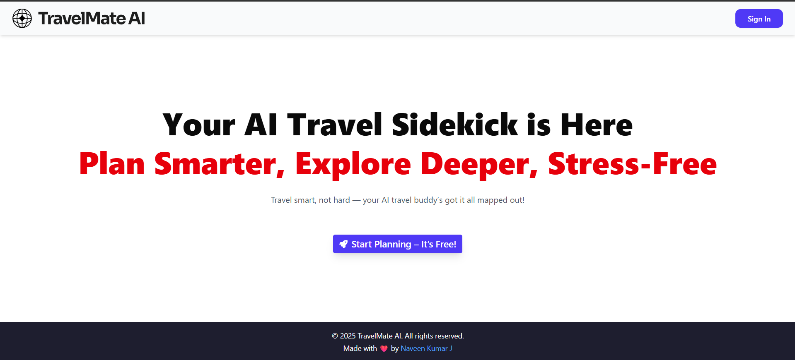
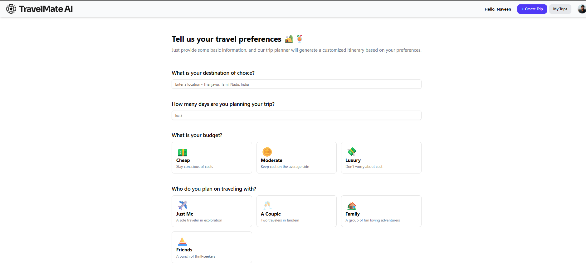
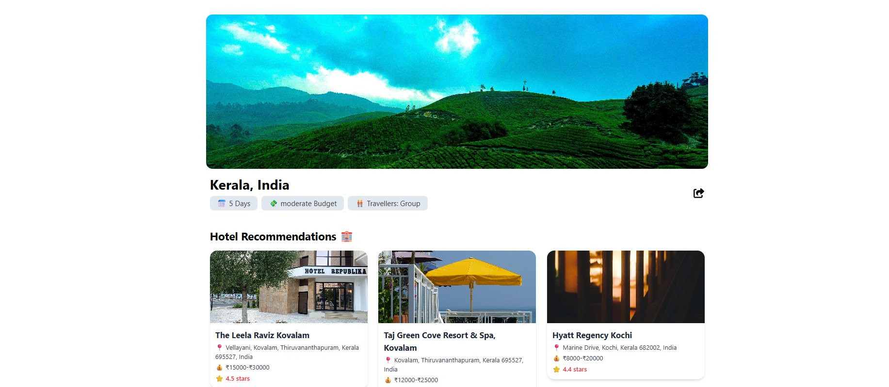
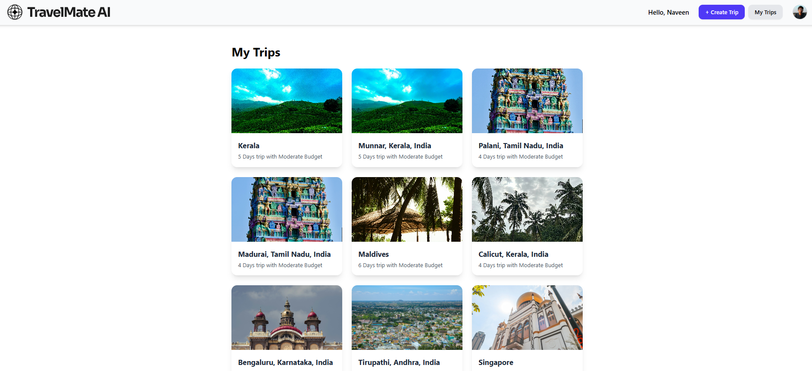

# TravelMate AI Planner 🌍✈️

An AI-powered travel planning web application built with React, enabling users to generate personalized trip itineraries using just a few inputs. Features include user authentication, trip management, real-time cloud sync, and an intuitive UI for an enhanced planning experience.

🔗 **Live Demo**: [https://travelmate-ai.vercel.app](https://travelmate-ai-planner.vercel.app/)






---

## 🚀 Features

* 🧠 **AI-Powered Planning**: Generates customized travel plans using Gemini AI based on user input
* 🔐 **User Authentication**: Secure login/signup with route protection (Firebase Auth)
* 📋 **Trip Management**: Create, view, and revisit past itineraries
* 💾 **Cloud Sync**: Trips are stored securely in Firebase Firestore
* 📱 **Responsive Design**: Tailwind CSS ensures smooth experience across devices
* 🌄 **Smart Location Images**: Fetches relevant location images using the Unsplash API
* 🗺️ **Google Maps Integration**: Clickable image redirects to the location on Google Maps
* 🔔 **Elegant Notifications**: Toast messages using Sonner

---

## 🛠️ Tech Stack

| Layer        | Technologies                                                                 |
| ------------ | ---------------------------------------------------------------------------- |
| **Frontend** | React, React Router, Tailwind CSS                                            |
| **Backend**  | Firebase Authentication, Firebase Firestore                                  |
| **AI**       | [Gemini API](https://ai.google.dev/) for smart itinerary generation          |
| **Images**   | [Unsplash API](https://unsplash.com/developers) for fetching location photos |
| **Toasts**   | [Sonner](https://sonner.emilkowal.ski/) for sleek notifications              |

---

## ⚠️ Image API Disclaimer

To fetch dynamic and aesthetic images of places, we considered using the **Google Places API**. However:

* **Google Places API** requires billing account setup and enables autopay if quota limits are exceeded.
* To avoid unexpected charges, we opted for the **Unsplash API** (free-tier).
* Due to the generic nature of Unsplash search, **exact location images may not always appear**.
* If Unsplash API limit is exceeded, **a default placeholder image will be shown**.
* Each image is **clickable** and will **redirect users to Google Maps** for that location.

---

## 🧩 Installation

```bash
git clone https://github.com/Naveen-KumarJ/travelmate-ai-planner.git
cd travelmate-ai-planner
npm install
npm run dev
```

---

## 🗝️ Environment Variables

Create a `.env` file in the root directory with the following content:

```env
VITE_FIREBASE_API_KEY=your_firebase_api_key
VITE_FIREBASE_AUTH_DOMAIN=your_auth_domain
VITE_FIREBASE_PROJECT_ID=your_project_id
VITE_FIREBASE_STORAGE_BUCKET=your_storage_bucket
VITE_FIREBASE_MESSAGING_SENDER_ID=your_messaging_sender_id
VITE_FIREBASE_APP_ID=your_app_id

VITE_UNSPLASH_API_KEY=your_unsplash_api_key
VITE_GEMINI_API_KEY=your_gemini_api_key
```

---

## 🔒 Protected Routes

All trip-related routes are protected using a custom `ProtectedRoute` component:

| Route                | Description                         |
| -------------------- | ----------------------------------- |
| `/create-trip`       | Create a new AI-generated trip      |
| `/my-trips`          | View all previously saved trips     |
| `/view-trip/:tripId` | View detailed plan of a single trip |

---

## 🧪 Available Scripts

| Command         | Description              |
| --------------- | ------------------------ |
| `npm run dev`   | Start dev server         |
| `npm run build` | Build app for production |

---

## 🙌 Acknowledgements

* [Firebase](https://firebase.google.com/) – Authentication & Firestore
* [Gemini AI API](https://ai.google.dev/) – Travel plan generation
* [Unsplash API](https://unsplash.com/developers) – Image fetching
* [React Router](https://reactrouter.com/) – Routing
* [Tailwind CSS](https://tailwindcss.com/) – Styling
* [Sonner](https://sonner.emilkowal.ski/) – Toast notifications

---

## 👨‍💻 Developed by

**Naveen Kumar J**
🔗 [LinkedIn](https://www.linkedin.com/in/naveen-kumar-j-44b4061ab/)

---